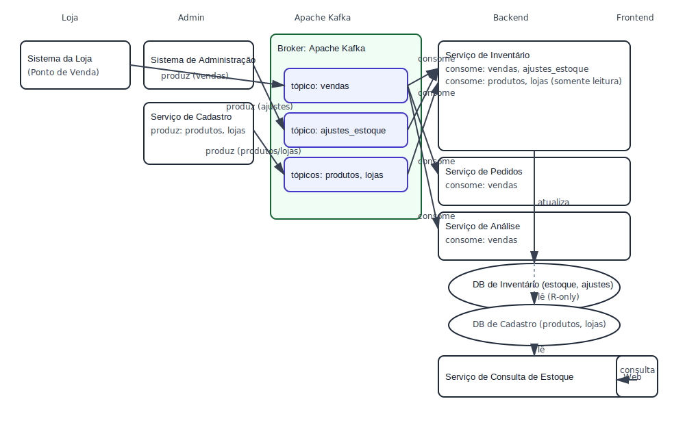

# Otimização de um Sistema de Gerenciamento de Inventário Distribuído

## 1. Objetivo

Este projeto visa projetar e prototipar uma arquitetura de backend moderna, resiliente e escalável para um sistema de gerenciamento de inventário distribuído. O objetivo é resolver os problemas de consistência de dados, alta latência na atualização de estoque e baixa observabilidade do sistema legado, que atualmente opera com uma sincronização periódica de 15 minutos entre as lojas e um banco de dados central.

## 2. O Problema Central

O sistema atual sofre com:
*   **Latência de Dados:** Um atraso de até 15 minutos para que uma venda em uma loja física se reflita no estoque central, levando a discrepâncias e possíveis vendas perdidas no e-commerce.
*   **Inconsistência de Estoque:** A falta de uma fonte única da verdade em tempo real causa conflitos de dados e torna o inventário pouco confiável.
*   **Baixa Escalabilidade:** A arquitetura monolítica atual dificulta a escalabilidade e a manutenção do sistema, especialmente em períodos de alta demanda.

## 3. Arquitetura Proposta: Orientada a Eventos com Apache Kafka

Para resolver esses desafios, propomos uma **Arquitetura Orientada a Eventos (Event-Driven Architecture)**, com o **Apache Kafka** atuando como o sistema nervoso central para a comunicação entre os serviços.

Neste modelo, os microsserviços não se comunicam diretamente. Em vez disso, eles publicam eventos (fatos imutáveis, como `VendaRealizada`) em tópicos do Kafka. Outros serviços, interessados nesses fatos, assinam os tópicos e reagem a eles de forma assíncrona.

Esta abordagem garante **desacoplamento**, **resiliência** (se um serviço cair, os eventos se acumulam no Kafka) e **escalabilidade** (podemos adicionar mais consumidores para processar eventos em paralelo).

### Diagrama da Arquitetura



<sub>POS e Admin produzem eventos para Kafka (vendas, ajustes_estoque). Serviço de Cadastro produz eventos de `produtos` e `lojas`. Inventário consome vendas/ajustes/produtos/lojas e atualiza o DB de Inventário; Pedidos e Análise consomem vendas; Serviço de Consulta lê do DB; Frontend consulta o Serviço de Consulta.</sub>

## 4. Microsserviços Detalhados

Diagrama (visão simplificada):

- Sistema da Loja (Ponto de Venda) -> produz eventos no Kafka (tópico: 'vendas')
- Sistema de Administração -> produz eventos no Kafka (tópico: 'ajustes_estoque')
- Serviço de Cadastro -> produz eventos de domínio (tópicos: 'produtos', 'lojas')
- Serviços que consomem do Kafka:
  - Serviço de Inventário: consome 'vendas', 'ajustes_estoque', 'produtos' e 'lojas'
  - Serviço de Pedidos: consome 'vendas'
  - Serviço de Análise: consome 'vendas'
- Bancos de Dados:
  - DB de Inventário: fonte da verdade operacional do estoque (atualizado pelo Serviço de Inventário)
  - DB de Cadastro: fonte da verdade de 'produtos' e 'lojas' (atualizado pelo Serviço de Cadastro)
- Serviço de Consulta de Estoque lê do Read DB/visões (derivadas de estoque/produtos/lojas) e é consultado pelo Frontend Web

A arquitetura é composta pelos seguintes microsserviços:

### a) Serviço de Inventário (Inventory Service)
É o coração do sistema e a fonte da verdade para o estoque.
*   **Responsabilidade:** Manter a contagem exata de cada produto em cada loja (tabela `estoque`). É o único serviço que **altera** o estado do inventário. Não é mais responsável por cadastrar produtos ou lojas.
*   **Interação com Kafka:**
    *   **Consome** o tópico `vendas` para diminuir o estoque.
    *   **Consome** o tópico `ajustes_estoque` para correções e recebimentos.
    *   **Consome** os tópicos de cadastro `produtos` e `lojas` somente para leitura/validação. Não grava nessas tabelas; a fonte da verdade é externa/replicada.
*   **Decisão de Design Crucial:** Este serviço deve ser **idempotente**. Ele rastreia os eventos já processados para garantir que uma mesma venda não seja contabilizada duas vezes.
*   **API:** Não expõe endpoints públicos de leitura para não competir com a tarefa crítica de escrita.

### b) Serviço de Consulta de Estoque (Stock Query Service)
A contraparte de leitura (Query) do padrão CQRS.
*   **Responsabilidade:** Fornecer uma visão somente leitura e otimizada do estoque para clientes externos (ex: frontend web).
*   **Interação com Kafka:** Nenhuma.
*   **API (Principais Endpoints):**
    *   `GET /api/inventory/stock?productId={idProduto}`: Retorna o estoque de um produto em todas as lojas.
    *   `GET /api/inventory/stock?productId={idProduto}&storeId={idLoja}`: Retorna o estoque de um produto em uma loja específica.
*   **Fonte de Dados:** Lê de um banco otimizado/replicado (read model/visões) derivado de `estoque`, e pode consultar visões que juntam `produtos` e `lojas` quando aplicável.

### c) Serviço de Pedidos (Order Service)
Gerencia o ciclo de vida de um pedido como um conceito de negócio.
*   **Responsabilidade:** Manter um registro histórico e detalhado de todas as vendas (pedidos).
*   **Interação com Kafka:**
    *   **Consome** o tópico `vendas` para criar e salvar um registro de pedido em seu próprio banco de dados.
*   **API (Principais Endpoints):**
    *   `GET /api/orders/{id}`: Busca os detalhes de um pedido específico.
    *   `GET /api/orders?customerId={idCliente}`: Busca o histórico de pedidos de um cliente.

### d) Serviço de Análise (Analytics Service)
Gera insights e relatórios a partir dos eventos de vendas.
*   **Responsabilidade:** Agregar métricas (por exemplo, vendas por período, por loja, por produto) e disponibilizar relatórios e painéis.
*   **Interação com Kafka:**
    *   **Consome** o tópico `vendas` para alimentar agregações quase em tempo real.
*   **Persistência:** Pode manter visões materializadas/aggregates em um armazenamento otimizado para leitura (ex.: H2/embarcado para protótipo).
*   **API (Principais Endpoints - opcional):**
    *   `GET /api/analytics/sales?from=...&to=...`.

### e) Sistema da Loja (Ponto de Venda - Produtor de Eventos)
A aplicação cliente que roda nas lojas físicas.
*   **Responsabilidade:** Registrar vendas e publicá-las como eventos no Kafka.
*   **Interação com Kafka:**
    *   **Produz** eventos no tópico `vendas`.
*   **Decisão de Design Crucial:** Implementa um mecanismo de **operação offline**. Se a conexão com o Kafka falhar, as vendas são salvas localmente e um sincronizador tenta reenviá-las quando a conexão é restabelecida. Isso prioriza a **disponibilidade** na loja.

### f) Sistema de Administração (Produtor de Eventos)
Ferramenta administrativa para ajustes de estoque (ex.: correção, recebimento, inventário).
*   **Responsabilidade:** Publicar ajustes de estoque conforme operações administrativas.
*   **Interação com Kafka:**
    *   **Produz** eventos no tópico `ajustes_estoque`. 

### g) Serviço de Cadastro (Products & Stores Service)
Serviço dedicado para cadastro de produtos e lojas.
*   **Responsabilidade:** Criar e atualizar o catálogo de produtos (`produtos`) e o cadastro de lojas (`lojas`).
*   **Interação com Kafka:**
    *   **Produz** eventos em tópicos de domínio: `produtos` (ex.: `produto_criado`, `produto_atualizado`, `produto_inativado`) e `lojas` (ex.: `loja_criada`, `loja_atualizada`).

## 4.1. Acesso ao Banco de Dados por Serviço

Para evitar ambiguidades e acoplamentos indevidos, seguem as regras explícitas de acesso a banco de dados por serviço:

- Serviço de Cadastro (Products & Stores Service)
  - Acesso: leitura e escrita nas tabelas de cadastro.
  - Escopo: banco de dados de cadastro (fonte da verdade para `produtos` e `lojas`).
  - Observações: publica eventos de domínio para propagação (`produtos`, `lojas`).

- Serviço de Inventário (Inventory Service)
  - Acesso: leitura e escrita.
  - Escopo: banco de dados de inventário (fonte da verdade operacional do estoque: tabela `estoque` e histórico `ajustes_estoque`).
  - Observações: único serviço autorizado a modificar o estado do estoque. Para `produtos` e `lojas`, apenas leitura/validação.

- Serviço de Consulta de Estoque (Stock Query Service)
  - Acesso: somente leitura.
  - Escopo: lê do banco otimizado/replicado; pode consultar visões materializadas derivadas de `estoque`, `produtos` e `lojas`.
  - Observações: não publica em Kafka e não realiza escrita no banco.

- Serviço de Pedidos (Order Service)
  - Acesso: leitura e escrita.
  - Escopo: seu próprio banco de dados de pedidos (separado do inventário e do cadastro).
  - Observações: mantém histórico de pedidos; consome o tópico `vendas` para persistir registros de pedido.

- Serviço de Análise (Analytics Service)
  - Acesso: leitura e escrita no seu próprio armazenamento de agregações/visões materializadas.
  - Escopo: armazenamento otimizado para leitura (ex.: H2/embarcado no protótipo); não acessa diretamente o banco de inventário.
  - Observações: consome `vendas` para alimentar agregações quase em tempo real.

- Sistemas Produtores (POS/Loja e Administração)
  - Acesso: não acessam bancos de dados centrais do backend.
  - Escopo: produzem eventos no Kafka (`vendas` e `ajustes_estoque`). Podem ter armazenamento local próprio apenas para resiliência offline.

Essas diretrizes asseguram o padrão CQRS e o princípio de fonte única da verdade para o estoque e para o cadastro.

## 4.2. Tabelas por Serviço

Abaixo estão as principais tabelas por domínio/serviço e o tipo de acesso. Os nomes são de referência para o protótipo (ver seção 8 para DDL de exemplo):

- Serviço de Cadastro (DB de Cadastro)
  - Tabelas (RW):
    - produtos: catálogo de produtos (fonte da verdade do cadastro de produtos).
    - lojas: cadastro de lojas (fonte da verdade do cadastro de lojas).
    - eventos_processados_cadastro: idempotência dos eventos produzidos/consumidos pelo serviço de cadastro (se consumir comandos por Kafka).

- Serviço de Inventário (DB de Inventário)
  - Tabelas (RW):
    - estoque: quantidade por produto e loja (fonte da verdade operacional).
    - ajustes_estoque: histórico de ajustes administrativos.
    - eventos_processados: controle de idempotência por evento Kafka (vendas/ajustes/cadastro).
  - Tabelas (R):
    - produtos, lojas: acessadas somente para leitura via conexão dedicada ou por réplica/CDC, conforme ambiente.

- Serviço de Consulta de Estoque (Read Model)
  - Tabelas/Visões (R):
    - stock_view: visão/materialização do estoque agregado por produto (pode ser uma view SQL sobre estoque).
    - stock_by_store_view: visão do estoque por produto e loja para consultas rápidas.
    - product_store_view: visão juntando `produtos`, `lojas` e `estoque` para APIs de leitura.

- Serviço de Pedidos (DB de Pedidos)
  - Tabelas (RW):
    - pedidos: cabeçalho do pedido (número, cliente, loja, total).
    - itens_pedido: itens pertencentes ao pedido.
    - (opcional) eventos_processados_pedidos ou outbox: para idempotência/integração futura.

- Serviço de Análise (Store de Analytics)
  - Tabelas/Agregados (RW):
    - sales_agg_by_period: agregações por período (dia, semana, mês).
    - sales_agg_by_store: agregações por loja.
    - sales_agg_by_product: agregações por produto.

- Sistemas Produtores (POS/Loja e Administração)
  - Tabelas no backend: não aplicável (não acessam o banco central do backend).
  - Observação: podem manter armazenamento local próprio apenas para operação offline.

## 4.3. Cadastro de Lojas (pelo Serviço de Cadastro)

O cadastro de lojas é de responsabilidade do Serviço de Cadastro, que é o dono da tabela `lojas` (ver Seção 8.3). O objetivo é manter um registro consistente das lojas que participam do controle de estoque.

- Propriedade e Escopo
  - Serviço de Cadastro mantém e versiona a tabela `lojas`.
  - Chave de negócio: `codigo` (único e imutável após criação). O `nome` pode ser atualizado.

- Formas de Cadastro/Atualização
  1) Via Evento Kafka (recomendado para produção)
     - Tópico: `lojas` (dedicado). Para o protótipo, pode-se reutilizar `ajustes_estoque` com tipo do evento, mas recomenda-se separar.
     - Eventos: `loja_criada` e `loja_atualizada`.
     - Payload (exemplo):
       ```json
       {
         "eventId": "9f5a3c7e-1d2b-4b2b-9a31-112233445566",
         "tipo": "loja_criada",
         "dados": {
           "codigo": "SP-01",
           "nome": "Loja São Paulo 01"
         }
       }
       ```
     - Processamento no consumidor (Inventário):
       - Verificar idempotência em `eventos_processados` usando `(topico, particao, offset)` antes de aplicar. Se já processado, ignorar com sucesso.
       - Executar UPSERT em `lojas` pela coluna `codigo` dentro de transação.
       - Opcional: inicializar linhas de `estoque` para produtos existentes de forma lazy (apenas quando o primeiro evento de estoque chegar) para evitar N×M inserts iniciais.

  2) Via Migração/Seed (infra)
     - Em ambientes novos, pode-se criar lojas via scripts Flyway (ver Seção 8.6 e 8.7) para dados base.

- SQL de Referência para UPSERT
  - PostgreSQL:
    ```sql
    INSERT INTO lojas (codigo, nome)
    VALUES (:codigo, :nome)
    ON CONFLICT (codigo) DO UPDATE SET nome = EXCLUDED.nome;
    ```
  - H2:
    ```sql
    MERGE INTO lojas (codigo, nome)
    KEY (codigo)
    VALUES (:codigo, :nome);
    ```

- Considerações de Resiliência e Auditoria
  - Idempotência: todos os eventos aplicados devem ser registrados em `eventos_processados` (ver Seção 8.3) antes do commit.
  - Observabilidade: logar `eventId` e `codigo` em cada transação de criação/atualização.
  - Retentativas: em falhas temporárias de DB, utilizar retry com backoff exponencial no consumidor.

- Integração com o Serviço de Inventário
  - O Serviço de Inventário consome o tópico `lojas` para manter um cache de validação e para vincular corretamente `loja_id` em `estoque`.
  - O Serviço de Inventário acessa `lojas` apenas para leitura; qualquer alteração é responsabilidade do Serviço de Cadastro.

## 4.4. Cadastro de Produtos (pelo Serviço de Cadastro)

O cadastro de produtos é de responsabilidade do Serviço de Cadastro, que é o dono da tabela `produtos` (ver Seção 8.3). O objetivo é manter um catálogo consistente de itens controlados em estoque.

- Propriedade e Escopo
  - Serviço de Cadastro mantém e versiona a tabela `produtos`.
  - Chave de negócio: `sku` (único e imutável após criação). Campos mutáveis: `nome`, `ativo`.

- Formas de Cadastro/Atualização
  1) Via Evento Kafka (recomendado para produção)
     - Tópico: `produtos` (dedicado). Para o protótipo, pode-se reutilizar `ajustes_estoque` com tipo do evento, mas recomenda-se separar.
     - Eventos: `produto_criado`, `produto_atualizado`, `produto_inativado` (soft delete via `ativo = false`).
     - Payloads (exemplos):
       ```json
       {
         "eventId": "5d9c2a7e-0c1a-4a3e-8e21-001122334455",
         "tipo": "produto_criado",
         "dados": { "sku": "SKU-123", "nome": "Camiseta Preta", "ativo": true }
       }
       ```
       ```json
       {
         "eventId": "7a2bd4e8-2c77-4b1b-9a50-667788990000",
         "tipo": "produto_atualizado",
         "dados": { "sku": "SKU-123", "nome": "Camiseta Preta Unissex" }
       }
       ```
       ```json
       {
         "eventId": "a1b2c3d4-e5f6-4789-a0b1-223344556677",
         "tipo": "produto_inativado",
         "dados": { "sku": "SKU-123" }
       }
       ```
     - Processamento no consumidor (Inventário):
       - Verificar idempotência em `eventos_processados` usando `(topico, particao, offset)` antes de aplicar. Se já processado, ignorar com sucesso.
       - `produto_criado`: inserir `sku`, `nome`, `ativo=true` (ou conforme payload) via UPSERT por `sku` dentro de transação.
       - `produto_atualizado`: atualizar apenas campos mutáveis (`nome`, opcionalmente `ativo` se vier no payload).
       - `produto_inativado`: marcar `ativo=false`. Não remover linhas de `estoque`; apenas impedir movimentações futuras para produtos inativos ao validar eventos de venda/ajuste.
       - Inicialização de estoque: não criar linhas em `estoque` proativamente; criar/atualizar de forma lazy quando chegar o primeiro evento de movimentação para uma loja.

  2) Via Migração/Seed (infra)
     - Em ambientes novos, pode-se criar o catálogo base via scripts Flyway (ver Seção 8.6 e 8.7), incluindo produtos essenciais.

- SQL de Referência para UPSERT
  - PostgreSQL:
    ```sql
    INSERT INTO produtos (sku, nome, ativo)
    VALUES (:sku, :nome, COALESCE(:ativo, TRUE))
    ON CONFLICT (sku) DO UPDATE SET
      nome = COALESCE(EXCLUDED.nome, produtos.nome),
      ativo = COALESCE(EXCLUDED.ativo, produtos.ativo);
    ```
  - H2:
    ```sql
    MERGE INTO produtos (sku, nome, ativo)
    KEY (sku)
    VALUES (:sku, :nome, COALESCE(:ativo, TRUE));
    ```

- Validações e Regras de Negócio
  - Eventos de venda/ajuste para `sku` inexistente: rejeitar com erro e registrar para DLQ/replay; opcionalmente ativar auto-cadastro controlado por feature flag em ambientes de dev.
  - Produtos `ativo=false` não devem permitir novas movimentações; consumidores devem validar antes de processar.
  - Nome do produto pode ser atualizado sem impacto em chaves; mudanças devem propagar apenas para leitura.

- Considerações de Resiliência e Auditoria
  - Idempotência: registrar todos os eventos aplicados em `eventos_processados` antes do commit.
  - Observabilidade: logar `eventId`, `sku` e o tipo do evento em cada transação.
  - Retentativas: em falhas temporárias de DB, utilizar retry com backoff exponencial.

- Integração com o Serviço de Inventário
  - O Serviço de Inventário consome o tópico `produtos` para validar movimentações de estoque e, opcionalmente, manter cache local de `sku`/status `ativo`.
  - O Serviço de Inventário acessa `produtos` apenas para leitura; qualquer alteração é responsabilidade do Serviço de Cadastro.

## 4.5. Serviço de Inventário — Detalhamento Operacional

Esta seção aprofunda o funcionamento interno do Serviço de Inventário, consolidando regras já apresentadas e adicionando orientações operacionais e técnicas.

- Eventos e Tópicos Processados
  - Consome `vendas`: diminui o estoque por item e loja.
  - Consome `ajustes_estoque`: corrige/incrementa o estoque (recebimento, inventário, acerto).
  - Consome `produtos` e `lojas` (do Serviço de Cadastro) para validação e cache local; não escreve nestas tabelas.

- Pipeline de Processamento (por mensagem)
  1) Deserialização e validação de schema (campos obrigatórios, tipos, versão de evento).
  2) Verificação de idempotência em `eventos_processados` usando `(topico, particao, offset)`; se já processado, concluir com sucesso (no-op).
  3) Validações de domínio:
     - `sku` deve existir e estar `ativo=true` (se inativo, rejeitar e enviar a DLQ ou registrar para replay).
     - `codigo` da loja deve existir.
     - Para eventos de venda: quantidade > 0; para ajuste: `delta` pode ser positivo ou negativo.
  4) Execução transacional:
     - Upsert em `estoque (produto_id, loja_id)` somando/subtraindo a quantidade/delta.
     - Para ajustes administrativos, registrar uma linha em `ajustes_estoque` (histórico).
     - Registrar o evento em `eventos_processados` antes do commit.
  5) Commit da transação; somente após isso confirmar o offset no Kafka.

- Concorrência e Atomicidade
  - Chave natural de concorrência: `(produto_id, loja_id)`.
  - Recomenda-se upsert atômico:
    - PostgreSQL: `INSERT ... ON CONFLICT (produto_id, loja_id) DO UPDATE SET quantidade = estoque.quantidade + EXCLUDED.quantidade`.
    - H2: `MERGE INTO estoque ...` usando chave composta.
  - Consumo paralelo: particionar tópicos por `produto_id` (ver Seção 8.9) para reduzir contendas.

- Regras de Negócio de Estoque
  - Estoque negativo:
    - Por padrão, bloquear quedas que resultem em quantidade < 0 e registrar o evento em DLQ; configurável via flag `inventory.allowNegative=false`.
    - Se habilitado (`true`), permitir negativo apenas para cenários específicos de backlog, com alertas.
  - Produtos inativos: não aceitar movimentações; registrar e DLQ.
  - SKU/loja desconhecidos: rejeitar e DLQ; em dev, permitir autocadastro sob feature flag para facilitar testes.

- Tabela de Idempotência (`eventos_processados`)
  - Estrutura de referência na Seção 8.3.
  - Chaves únicas: `event_id` e `(topico, particao, offset)`.
  - Política de retenção: manter registros por período suficiente para cobrir reprocessamentos; limpeza por job assíncrono.

- Observabilidade
  - Logs estruturados com `eventId`, `topic`, `partition`, `offset`, `sku`, `store` e resultado (aplicado/ignorado/erro).
  - Métricas (exemplos):
    - `inventory_events_total` (labels: tipo, resultado)
    - `inventory_stock_update_latency_ms`
    - `inventory_dlq_total`
  - Tracing distribuído: propagar `traceId` se presente no cabeçalho do evento.

- Estratégia de Erros
  - Retries com backoff exponencial para erros transitórios de DB ou rede.
  - Poison-pill handling: após N falhas consecutivas no mesmo offset, publicar em DLQ e avançar.
  - DLQ por tópico de origem (ex.: `vendas.DLQ`, `ajustes_estoque.DLQ`).

- Configurações Recomendadas
  - `max.poll.records` ajustado ao tempo de transação para evitar rebalance frequente.
  - `enable.auto.commit=false` e commit manual pós-transação.
  - Tamanho de lote: considerar processamento em lote com upserts agregados por `(produto, loja)` para ganhos de throughput.

- SQL de Referência
  - Upsert Estoque (PostgreSQL):
    ```sql
    INSERT INTO estoque (produto_id, loja_id, quantidade)
    VALUES (:produtoId, :lojaId, :delta)
    ON CONFLICT (produto_id, loja_id) DO UPDATE
    SET quantidade = estoque.quantidade + EXCLUDED.quantidade,
        atualizado_em = CURRENT_TIMESTAMP;
    ```
  - Registro de Ajuste (PostgreSQL):
    ```sql
    INSERT INTO ajustes_estoque (produto_id, loja_id, delta, motivo)
    VALUES (:produtoId, :lojaId, :delta, :motivo);
    ```

- Sequência de Exemplo (Venda)
  1) Mensagem `venda_realizada` chega no tópico `vendas` com itens [{sku, quantidade}] e `storeCode`.
  2) Serviço resolve `produto_id` e `loja_id` via leitura de `produtos` e `lojas` (ou cache local).
  3) Verifica idempotência; valida ativo e saldo suficiente.
  4) Executa transação: upsert estoque para cada item; registra `eventos_processados`.
  5) Comita e confirma offset.

Referências: Seções 4.1, 4.2, 8.3, 8.4 e 8.9.

## 5. Estratégia Técnica e Stack

*   **Linguagem e Framework:** Java 22 com Spring Boot 3.x, que oferece excelente integração com o Kafka (`spring-kafka`).
*   **Mensageria:** Apache Kafka, para comunicação assíncrona e resiliente.
*   **Padrão de Arquitetura:** CQRS (Command Query Responsibility Segregation), separando as operações de escrita (comandos, via Kafka) das de leitura (consultas, via API REST), permitindo otimizações e escalabilidade independentes.
*   **Persistência de Dados (Simulação):**
    *   **Serviço de Inventário:** Um mapa em memória (`ConcurrentHashMap`) ou um banco de dados em memória (H2) para simular a rapidez de um banco como Redis.
    *   **Serviço de Pedidos:** Uma coleção de objetos em memória ou H2 para simular um banco de dados relacional.

## 6. Instruções de Execução (run.md)

*(Esta seção deve ser detalhada no arquivo `run.md`)*

1.  **Pré-requisitos:**
    *   Java 22
    *   Maven
    *   Docker e Docker Compose

2.  **Inicialização do Ambiente:**
    *   Execute `docker-compose up -d` na raiz do projeto para iniciar as instâncias do Apache Kafka e Zookeeper.

3.  **Executando os Microsserviços:**
    *   Navegue até o diretório de cada serviço (ex: `inventory-service/`).
    *   Execute `mvn spring-boot:run` para iniciar cada um dos serviços (`inventory-service`, `stock-query-service`, etc.).

4.  **Testando o Fluxo:**
    *   *(Exemplos de como publicar um evento de venda no Kafka e verificar se o estoque foi atualizado seriam incluídos aqui).*

## 7. Decisões Chave de Arquitetura

*   **Adoção de Arquitetura Orientada a Eventos:** Fundamental para desacoplar os serviços, garantir resiliência e permitir escalabilidade.
*   **Uso do Padrão CQRS:** Separar a responsabilidade de escrita e leitura permite otimizar ambos os caminhos de forma independente, melhorando a performance e a escalabilidade geral do sistema.
*   **Priorização da Disponibilidade na Loja:** A decisão de implementar um mecanismo de fallback offline no ponto de venda garante que o negócio continue operando mesmo com falhas de rede, aceitando uma consistência eventual.
*   **Idempotência nos Consumidores:** Uma necessidade em sistemas de mensagens para garantir a correção dos dados, evitando o processamento duplicado de eventos.

## 8. Banco de Dados (Detalhado)

Esta seção descreve o modelo de dados que suporta a arquitetura proposta, com foco na fonte de verdade do estoque (escrita pelo Serviço de Inventário), nos cadastros de produtos e lojas (escritos pelo Serviço de Cadastro) e nas necessidades de leitura (consumidas pelo Serviço de Consulta).

### 8.1 Princípios
- Fonte única da verdade para estoque é mantida no banco relacional (pode ser H2 em desenvolvimento e PostgreSQL em produção).
- Idempotência é garantida registrando eventos já processados.
- CQRS: o mesmo banco pode ser usado para leitura neste protótipo; em produção recomenda-se réplica/Read DB separado.

### 8.2 Modelagem Lógica
Entidades e relacionamentos principais (ownership):
- produtos (1) — estoque (N) [produtos: Serviço de Cadastro; estoque: Serviço de Inventário]
- lojas (1) — estoque (N) [lojas: Serviço de Cadastro; estoque: Serviço de Inventário]
- pedidos (1) — itens_pedido (N) [Serviço de Pedidos]
- eventos_processados (idempotência) [cada serviço mantém sua própria tabela]
- ajustes_estoque (histórico de ajustes administrativos) [Serviço de Inventário]

### 8.3 Esquema Relacional (SQL de referência)
Compatível com H2/PostgreSQL (tipos genéricos; ajuste conforme o alvo).

```sql
-- Produtos
CREATE TABLE produtos (
  id              BIGINT GENERATED BY DEFAULT AS IDENTITY PRIMARY KEY,
  sku             VARCHAR(64) NOT NULL UNIQUE,
  nome            VARCHAR(255) NOT NULL,
  ativo           BOOLEAN NOT NULL DEFAULT TRUE,
  criado_em       TIMESTAMP NOT NULL DEFAULT CURRENT_TIMESTAMP
);

-- Lojas
CREATE TABLE lojas (
  id              BIGINT GENERATED BY DEFAULT AS IDENTITY PRIMARY KEY,
  codigo          VARCHAR(32) NOT NULL UNIQUE,
  nome            VARCHAR(255) NOT NULL,
  criado_em       TIMESTAMP NOT NULL DEFAULT CURRENT_TIMESTAMP
);

-- Estoque por produto/loja (fonte da verdade)
CREATE TABLE estoque (
  produto_id      BIGINT NOT NULL REFERENCES produtos(id),
  loja_id         BIGINT NOT NULL REFERENCES lojas(id),
  quantidade      BIGINT NOT NULL,
  atualizado_em   TIMESTAMP NOT NULL DEFAULT CURRENT_TIMESTAMP,
  PRIMARY KEY (produto_id, loja_id)
);
CREATE INDEX idx_estoque_loja ON estoque(loja_id);
CREATE INDEX idx_estoque_produto ON estoque(produto_id);

-- Idempotência: eventos Kafka já aplicados pelo serviço correspondente (cada serviço mantém sua própria tabela)
CREATE TABLE eventos_processados (
  event_id        VARCHAR(100) PRIMARY KEY,
  topico          VARCHAR(100) NOT NULL,
  particao        INT NOT NULL,
  offset          BIGINT NOT NULL,
  processado_em   TIMESTAMP NOT NULL DEFAULT CURRENT_TIMESTAMP
);
CREATE UNIQUE INDEX uq_evento_topico_particao_offset ON eventos_processados(topico, particao, offset);

-- Histórico de Ajustes de Estoque (administrativo)
CREATE TABLE ajustes_estoque (
  id              BIGINT GENERATED BY DEFAULT AS IDENTITY PRIMARY KEY,
  produto_id      BIGINT NOT NULL REFERENCES produtos(id),
  loja_id         BIGINT NOT NULL REFERENCES lojas(id),
  delta           BIGINT NOT NULL, -- positivo para recebimento, negativo para correção/baixa
  motivo          VARCHAR(255),
  criado_em       TIMESTAMP NOT NULL DEFAULT CURRENT_TIMESTAMP
);
CREATE INDEX idx_ajuste_prod_loja ON ajustes_estoque(produto_id, loja_id);

-- Pedidos e Itens (consumidos do tópico 'vendas')
CREATE TABLE pedidos (
  id              BIGINT GENERATED BY DEFAULT AS IDENTITY PRIMARY KEY,
  numero          VARCHAR(64) NOT NULL UNIQUE,
  cliente_id      VARCHAR(64),
  loja_id         BIGINT REFERENCES lojas(id),
  total_centavos  BIGINT NOT NULL,
  criado_em       TIMESTAMP NOT NULL DEFAULT CURRENT_TIMESTAMP
);

CREATE TABLE itens_pedido (
  id              BIGINT GENERATED BY DEFAULT AS IDENTITY PRIMARY KEY,
  pedido_id       BIGINT NOT NULL REFERENCES pedidos(id) ON DELETE CASCADE,
  produto_id      BIGINT NOT NULL REFERENCES produtos(id),
  quantidade      BIGINT NOT NULL,
  preco_centavos  BIGINT NOT NULL
);
CREATE INDEX idx_itens_pedido_pid ON itens_pedido(pedido_id);
```

### 8.4 Regras de Negócio e Concorrência
- Atualizações de estoque devem ser atômicas por par (produto_id, loja_id).
- Para consumo idempotente: antes de aplicar uma venda/ajuste, verificar se o (topico, particao, offset) já está em eventos_processados.
- Estratégias de upsert recomendadas:
  - PostgreSQL: INSERT ... ON CONFLICT (produto_id, loja_id) DO UPDATE SET quantidade = estoque.quantidade + EXCLUDED.quantidade.
  - H2: MERGE INTO estoque ... utilizando chave composta.

### 8.5 Consultas Típicas
- Estoque de um produto em todas as lojas:
```sql
SELECT l.codigo, l.nome, e.quantidade
FROM estoque e JOIN lojas l ON l.id = e.loja_id
WHERE e.produto_id = :produtoId;
```
- Estoque de um produto em uma loja específica:
```sql
SELECT quantidade FROM estoque
WHERE produto_id = :produtoId AND loja_id = :lojaId;
```

### 8.6 Migrações e Versionamento
- Use Flyway (recomendado no ecossistema Spring):
  - diretório: src/main/resources/db/migration
  - arquivos: V1__baseline.sql, V2__ajustes_estoque.sql, etc.
- Alternativa: Liquibase com changelogs YAML/XML.

### 8.7 Dados de Exemplo (seed)
```sql
INSERT INTO produtos (sku, nome) VALUES ('SKU-001','Camiseta Básica'), ('SKU-002','Calça Jeans');
INSERT INTO lojas (codigo, nome) VALUES ('SP-01','Loja São Paulo 01'), ('RJ-01','Loja Rio 01');
INSERT INTO estoque (produto_id, loja_id, quantidade) VALUES (1,1,100),(1,2,80),(2,1,50),(2,2,40);
```

### 8.8 Observabilidade e Auditoria
- Tabelas de histórico (ajustes_estoque, pedidos, itens_pedido) suportam auditoria básica.
- Recomenda-se logar o event_id e numero do pedido em cada transação.

### 8.9 Escalabilidade e Particionamento
- Particionar tópicos Kafka por produto_id para melhor paralelismo de consumidores.
- No banco, considerar sharding por loja_id ou uso de réplicas de leitura em produção.


## 9. Configurações do InventoryService e Idempotência

### 9.1. Configurações (application.yml)
Um arquivo padrão foi adicionado em `InventoryService/src/main/resources/application.yml` para centralizar propriedades:

- inventory.kafka.group-id: grupo padrão dos consumidores do serviço.
- inventory.kafka.topics:
  - vendas: nome do tópico de vendas (default: `vendas`).
  - ajustes: nome do tópico de ajustes de estoque (default: `ajustes_estoque`).
  - produtos: nome do tópico de produtos (default: `produtos`).
  - lojas: nome do tópico de lojas (default: `lojas`).
- spring.kafka.bootstrap-servers: servidor Kafka (default: `localhost:9092`, pode ser sobrescrito por env `KAFKA_BOOTSTRAP_SERVERS`).
- spring.jpa.hibernate.ddl-auto: `update` para facilitar o protótipo (ajuste conforme ambiente).
- logging.level: níveis de log padrão.

Essas chaves são usadas pelos `@KafkaListener` existentes através de placeholders como `${inventory.kafka.topics.vendas:vendas}`.

### 9.2. Idempotência
O serviço mantém idempotência registrando eventos processados na tabela `eventos_processados` com unicidade em `(topico, particao, offset)`.

- Caso os metadados do Kafka estejam presentes (tópico, partição, offset), eles são usados diretamente.
- Caso faltem metadados (por exemplo, em testes/manuais), o serviço faz fallback para o `eventId` do evento:
  - Usa `topico = "eventId"`, `particao = 0`, `offset = hash(eventId)` como chave sintética.
  - Se `eventId` também faltar, o evento é processado uma vez sem rastreamento (comportamento atual para não bloquear).

Esse mecanismo evita processamento duplicado tanto em consumo normal via Kafka quanto em cenários sem metadados, mantendo o comportamento idempotente alinhado ao design descrito acima.
